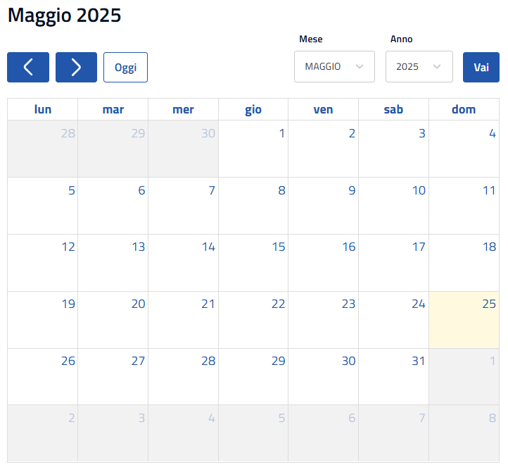

---
---
# Calendario

Qui ci va una piccola guida su come usare il calendario e magari la navigazione ?

è possibile mettere le immagini salvandole nella cartella /img e fare riferimento con la sintassi md delle immagini:

### Questo è un calendario vuoto: 

### Questo un calendario con degli eventi

Qui c'è un calendario con gli eventi 

### Navigazione

Qui invece è possibile vedere come si naviga:

